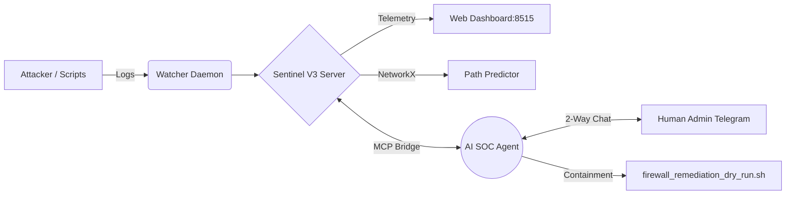

<div align="center">
  
  
  
  
  
  <h1>🛡️ Sentinel V3 </h1>
  <p><b>Autonomous AI Security Operations Center (SOC) Proof of Concept</b></p>
</div>

<br/>

## 📖 Overview
**Sentinel V3** is a Blue Team defense demo architecture. It combines **NetworkX threat graphing** for lateral movement prediction with the cognitive reasoning of **Large Language Models (Hermes/Gemini)** via an MCP interface to achieve Human-in-the-Loop (HITL) Security Orchestration, Automation, and Response (SOAR).

Instead of purely static SIEM alerts, Sentinel V3 builds an in-memory **Cyber Knowledge Graph** of the network, predicts APT kill-chains, and orchestrates simulated containment strategies via Telegram.

> **Disclaimer:** This is a portfolio/learning artifact and a proof of concept. It is not a production-grade security appliance.

## ✨ Key Features
- **🧠 Graph Predictive Engine:** In-memory NetworkX graphing that uses heuristics and lightweight PyTorch neighbors (with a native NumPy fallback) to predict attacker lateral movement.
- **🤖 Autonomous SOAR Agent:** AI-driven incident triage that evaluates threats and generates remediation rule drafts (dry-run iptables).
- **📱 Telegram HITL Integration:** A demo 2-way Telegram gateway that simulates cryptographic `AUTH_TOKEN` approvals before containment (Note: The notifier is deliberately muted in this demo branch to prevent active messaging).
- **🍯 Dynamic Honeypot Deployment:** Deploys active deceptive assets (e.g., fake SSH/FTP servers) to trap attackers locally.
- **📊 Real-Time SOC Dashboard:** A pure Python/HTML/JS unified dashboard broadcasting live telemetry on port 8515.

## 🏗️ Architecture



## 🚀 Quick Start (Installation)

Get the Sentinel V3 demo running locally:

```bash
# 1. Clone the repository
git clone https://github.com/hearthacker003366/sentinelV3.git
cd sentinelV3

# 2. Configure Environment
cp .env.example .env

# 3. Install dependencies
pip install -r requirements.txt
pip install -r requirements-dev.txt  # If you want to run the test suite

# 4. Boot the Unified Dashboard & Watcher Daemon
python3 sentinelctl.py start
```
*Access the live SOC Dashboard at: `http://127.0.0.1:8515`*

## 📁 Repository Structure
- `backend/` - Core backend services (Mem IPC, Graph Predictor, SOAR engine).
- `dashboard/` - Zero-dependency HTML/JS/CSS frontend and polling server.
- `mcp_server/` - Model Context Protocol (MCP) server for native AI Agent tool execution.
- `demo_tools/` - APT simulation scripts.
- `docs/architecture/` - Architectural research and project notes.

## 🤝 Contributing
Contributions, issues, and feature requests are welcome! 
We use **CodeRabbit AI** for assertive, automated PR reviews. Ensure your code passes all tests (`pytest tests/`) before submitting.

## 📝 License
This project is licensed under the MIT License - see the [LICENSE](LICENSE) file for details.
